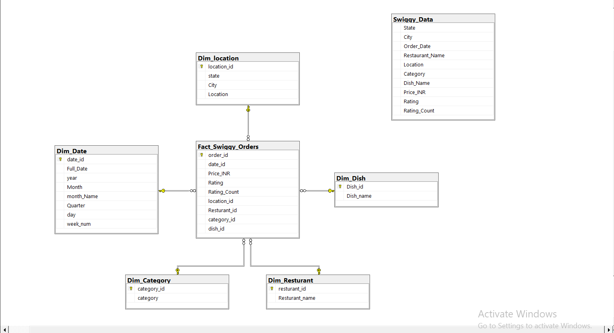

🍽 Swiggy SQL Data Warehouse & Business Analysis
📌 Project Overview

This project demonstrates the design and implementation of a SQL-based Data Warehouse using Swiggy order data.

The goal was to transform raw transactional data into a structured Star Schema and extract business insights using analytical SQL queries.

🛠 Tools Used

SQL Server

T-SQL

Star Schema Modeling

Window Functions (ROW_NUMBER, RANK)

🏗 Data Modeling

Designed a Star Schema including:

Fact_Swiggy_Orders

Dim_Date

Dim_Location

Dim_Restaurant

Dim_Category

Dim_Dish

ERD:

📊 Key KPIs

Total Orders:  [197401]

Total Revenue: [53.00 INR Million] 

Average Dish Price: [268.50 INR]

Highest Revenue State: [Karnataka = 5.46 INR million]

Most Ordered Dish: [Veg Fried Rice = 321]

📈 Analytical Queries Included

Monthly / Quarterly / Yearly Trends

Revenue Contribution by State

Top 10 Restaurants by Revenue

Cuisine Performance Analysis

Customer Spending Distribution

Rating Distribution Analysis

🚀 What This Project Demonstrates

Data Cleaning & Validation

Dimensional Modeling

Fact-Dimension Relationships

## Data Warehouse ERD

Advanced SQL Querying

Business-Oriented Data Analysis
